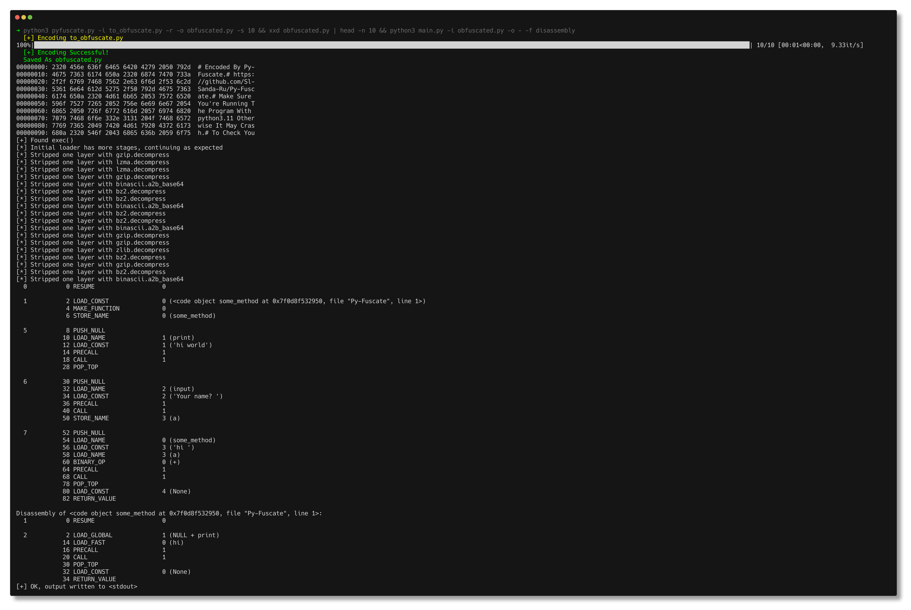

# Nofuscate
Defeating Py-Fuscate



## How?
The entire py-fuscate gag is thousands of decompresses. The pattern doesn't change often if at all, so detecting and extracting data and the decompression method is trivial.

## Usage
```
usage: NoFuscate [-h] -i INPUT -o OUTPUT [-f {disassembly,marshal,pyc}]

Defeating Py-Fuscate, one decompress a time

options:
  -h, --help            show this help message and exit
  -i INPUT, --input INPUT
                        The py-fuscate obfuscated input (NOT compiled; source code)
  -o OUTPUT, --output OUTPUT
                        The output file
  -f {disassembly,marshal,pyc}, --format {disassembly,marshal,pyc}
                        Which format to write to the output file
```

## Example
Assume obfuscated.py is the obfuscated output of py-fuscate

`main.py -i obfuscated.py -o - -f disassembly`

Reads obfuscated.py, deobfuscates it and writes the deobfuscated disassembly to stdout (`-`)

To write to a file instead:

`main.py -i obfuscated.py -o output.txt -f disassembly`
